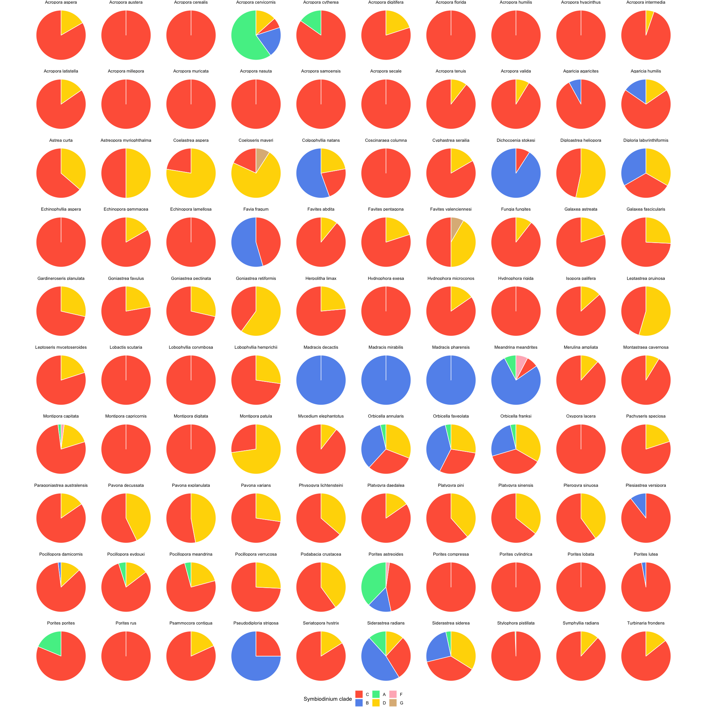
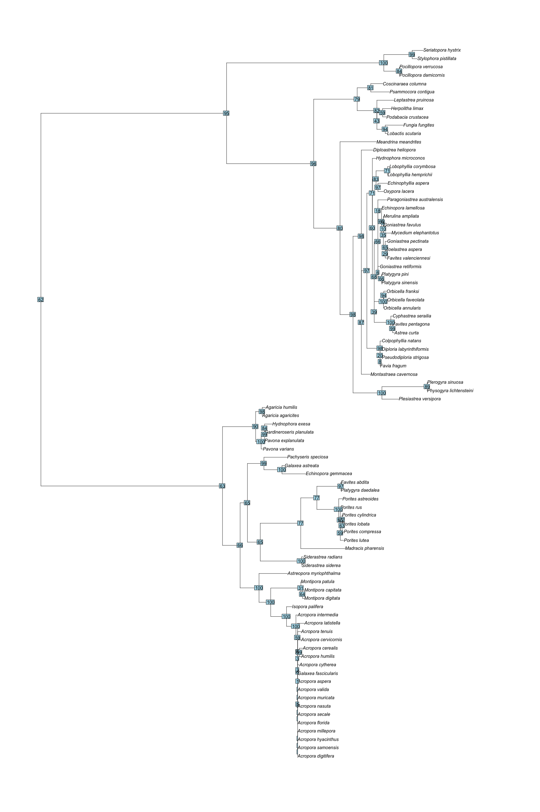
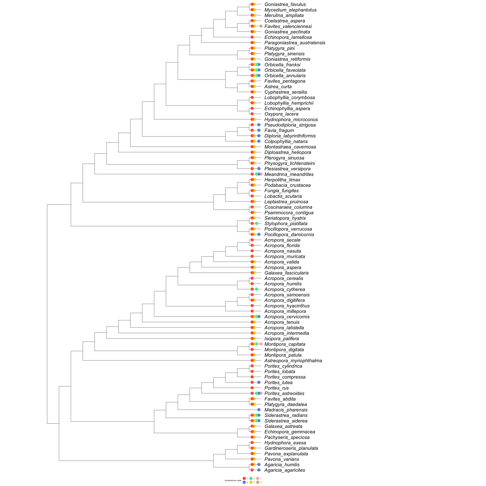

README
================
R Ju
12/9/2020

# Phylogenetic signal in stony coral (*Scleractinia*) associations with algal symbionts (*Symbiodinium*)

## Introduction

Reef-building corals (*Scleractinia*) rely on associations with
dinoflagellate algae of the genus *Symbiodinium* for survival, obtaining
up to 95% of their energy from symbiont photosynthates (Muscatine and
Porter 1977). Recent reclassification of *Symbiodinium* dinoflagellates
places existing species into seven genera, commonly referred to as
Clades A-F (LaJeunesse et al. 2018). Six of the seven clades (A, B, C,
D, F, G) have been found to associate with *Scleractinia* species (Baker
2003).

*Symbiodinium* associations can arise through vertical or horizontal
transmission. Some corals transfer parental symbionts directly to their
offspring (Baird et al. 2009). In most non-brooding coral species,
however, offspring are produced without symbionts, instead taking up
multiple types from their environment (Little et al. 2004). Over time,
one clade becomes dominant, with most corals maintaining clade
associations through adulthood ((Reich et al. 2017; Cunning et al. 2018;
Goulet 2006). Changes in *Symbiodinium* clade within a single
individual, known as “shuffling”, has been observed at various coral
life-stages . Additionally, many *Scleractinia* species can harbor more
than *Symbiodinium* clade, at times within the same host colony (Baker
2003).

The diversity of *Symbiodinium* and the formation mechanisms of
coral-algal symbioses suggest high plasticity in *Symbiodinium* clade
association. Additionally, it is apparent that the observed or realized
clade associations may not accurately represent the potential
associations in each host species. Some studies suggest that local
availability is the main driver in determining clade associations, while
others point towards host selectivity in symbiont type (van Oppen et
al. 2001). Currently, it remains unclear what factors contribute to the
ability of coral species to associate with *Symbiodinium* clades.

In recent years, ocean warming due to climate change has caused
disruptions in these coral-algal associations, leading to the phenomenon
known as coral bleaching. As coral reefs continue to decline, there has
been increasing interest in functional or fitness variations in
*Symbiodinium* clade associations. For example, research has shown that
clade A is less beneficial to coral hosts compared to clade C (Stat et
al. 2008). Additionally, many studies suggest clade D is the most
thermally tolerant of the *Symbiodinium* clades, and may therefore play
a critical role in reef resilience to marine heatwaves (Jones et
al. 2008; Berkelmans and Van Oppen 2006; Rowan 2004; Silverstein et
al. 2015). As bleaching continues to rise in frequency and magnitude,
it becomes increasingly urgent to understand the factors contributing to
the ability of corals to association with different *Symbiodinium*
clades.

In this study, I assess the impact of phylogenetic relationships on
*Scleractinia* coral associations with *Symbiodinium* clades. First, I
assess the distribution of *Symbiodinium* clade associations using
publicly available data from the [Coral Trait Database](coraltraits.org)
(Madin et al. 2016). Then, I construct a phylogenetic tree for
*Scleractinia* species and map observed *Symbiodinium* clade association
for a visual evaluation of phylogenetic patterning. Finally, I use three
methods of character coding in order to quantify the phylogenetic
signal.

## Methods

Publicly available data for *Symbiodinium* clade associations with
*Scleractinia* species were collected from the [Coral Trait
Database](coraltraits.org) along with location metadata. Species with at
least 10 *Symbiodinium* clade observations were used in phylogenetic
analysis.

Gene sequence data for *Scleractinia* species were downloaded from the
National Center for Biotechnology Information (NCBI) database.
Mitochondrial sequence data for the cytochrome oxidase 1 (CO1) subunit
were collected using the NCBI Basic Local Alignment Search Tool (BLAST).
A bait sequence for the CO1 gene was chosen within the study taxa
(*Acropora digitifera*). CO1 sequence data was also collected for an
outgroup species, *Xestospongia testudinaria* (barrel sponge). All
sequences were aligned in BLAST before downloading as a FASTA file. Raw
alignment sequence data was processed to assign species headers, and
concatenated using the R package ‘apex’ to remove duplicate species.

Phylogenetic inference was conducted using IQ-TREE on the Yale Center
for Research Computing (YCRC) cluster (Nguyen et al. 2015). Maximum
likelihood analysis was conducted with 1000 bootstrap replicates. The R
package ‘ape’ was used to root the tree to the specific outgroup species
and to trim the tree to exclude tips with no *Symbiodinium* clade data.
The tree was visualized as a cladogram with trait data using the R
package ‘ggtree’.

The character trait of *Symbiodinium* clade associations was coded in
three ways:

1.  Using only the most-associated clade as a single categorical trait.

2.  Treating associations with each clade as six separate binary traits.

3.  Consider the number of clades associated as a single categorical
    trait.

For each method, phylogenetic signal was assessed using the R package
‘geiger’ to calculate Pagel’s lambda.

See scripts/final\_project.rmd file for analysis code.

## Results

### *Symbiodinium* clade association data

At least 10 observations were found for 100 *Scleractinia* species, with
the number of total observations ranging from 10 to 158. Clade C was
most commonly observed, followed by clades D, B, and A. Clades F and G
were only observed 4 and 2 times, respectively. The number of species in
which the clades were observed followed the same trend (Table 1).

| Clade | \# observations | \# host species |
| ----- | --------------- | --------------- |
| A     | 53              | 14              |
| B     | 183             | 21              |
| C     | 1846            | 97              |
| D     | 388             | 62              |
| F     | 4               | 3               |
| G     | 2               | 2               |

**Table 1** Table showing *Symbiodinium* clades, the number of observed
associations, and the number of species associated with.

Of the 100 study species, 27 were only found to associate with one
*Symbiodinium* clade, while 56 were found to associate with 2 clades. 8
and 9 species associated with 3 and 4 clades, respectively. The pie
charts in Figure 1 visualize the proportional distribution of
*Symbiodinium* clade associations per species.

<!-- --> **Figure 1.** Pie charts
showing the proportion of observations attributed to each *Symbiodinium*
clade per *Scleractinia* species.

### Phylogenetic inference

<!-- --> **Figure 2** Rooted
phylogenetic tree for *Scleractinia* with ML support values, generated
with CO1 mitochondrial gene sequences. Only tips with *Symbiodinium*
clade association data are shown.

Figure 2 shows the rooted phylogenetic tree for all *Scleractinia*
species with trait data, generated from IQ-TREE with maximum likelihood
support values. The best model fit by Bayesian information criteria
(BIC) was TVM+F+I+G4, with a log likelihood value of -15093.3637.

<!-- --> **Figure 3**
Cladogram of 86 *Scleractinia* species. Colored points at tips
correspond to observed *Symbiodinium* clade associations.

Figure 3 shows the phylogenetic reconstruction as a cladogram, as well
as known *Symbiodinium* clade associations. Some grouping in
associations with less common clades (A, B) are apparent, for example in
*Orbicella* species. However, no clade is grouped monophyletically
(excluding G, observed in one species).

### Phylogenetic signal assessment

To determine if there is strong phylogenetic signal in *Symbiodinium*
clade associations in *Scleractinia*, Pagel’s lambda was calculated for
three different character codings (Table 2). A lambda value of 0
indicates no phylogenetic signal, while a lambda value of 1 indicates
high phylogenetic signal (Brownian motion model).

| Method | Coding                | lambda value |
| ------ | --------------------- | ------------ |
| 1      | Most-associated clade | 0.733        |
| 2a     | Clade A association   | 0.906        |
| 2b     | Clade B association   | 0.994        |
| 2c     | Clade C association   | 1.000        |
| 2d     | Clade D association   | 0.414        |
| 3      | \# clades associated  | 0.399        |

**Table 2** Pagel’s lambda values for various character coding methods.

The first method of character coding by most-associated clade resulted
in a lambda value of 0.733, which shows moderate phylogenetic signal.
The second method, in which association with each clade is treated as a
separate binary trait, yielded \>0.9 lambda values for clades A and B,
suggesting strong phylogenetic signal. Association with clade C resulted
in a 1.000 lambda value — however, as clade C is nearly ubiquitous
across the tree due to incomplete sampling, this does not give any
information on phylogenetic signal. The lambda value for clade D
association was 0.414, indicating a low phylogenetic signal. Similarly,
the third method considering the number of clades found in association
led to a lamda value of 0.399, also showing low phylogenetic signal.

## Discussion

These mixed results indicate that the evolution of symbiotic
associations between *Scleractinia* species and *Symbiodinium* clades
may only be driven partially by host phylogeny. Visual assessment of
phylogenetic patterning did not yield any clear grouping in clade
associations.

There was moderate support for phylogenetic effect when *Symbiodinium*
clade was coded as the most-associated clade. This character can be
interpreted as the “preferred” clade for each host species, suggesting
some phylogenetic influence on the most compatible *Symbiodinium* clade.
However, this study does not provide evidence for this interpretation,
as the most-associated clade may be an artifact of uneven sampling.

Associations with particular clades do show phylogenetic signal, though
it is much lower for clade D compared to clades A and B. This suggests
that the factors that determine the potential for clade associations may
vary by clade. This variation may be due to the biogeography of
*Symbiodinium* and local availability at time of uptake. Additionally,
this suggests the possibility that there are “preference” rankings for
*Symbiodinium* clades, but no limitation on the potential of a host to
form an association.

Finally, evaluations of phylogenetic signal suggest that the number of
clades associated with each host species is not determined by
phylogenetic history. This may indicate that coral hosts are not
genetically limited in their ability to associate with various
*Symbiodinium* clades. Other factors, such as local availability, likely
play a larger role in determining the number of associated clades.

Ultimately, I do not feel confident that any of the character coding
methods accurately capture the trait of *Symbiodinium* clade
association. However, as *Symbiodinium* clade associations are generally
characterized as multi-state categorical traits, many common methods for
measuring phylogenetic signal (phylogenetic independent contrasts,
phylogenetic least-squares regression, etc.) are not possible. In future
research, I would investigate other methods of character coding, as well
as include other analyses of phylogenetic signal in categorical traits.

As in most cases with public databases, there are issues of sample size
variation and sampling bias within the symbiont clade data. For example,
*Acropora* species are disproportionately sampled, as they are a crucial
study species on the Great Barrier Reef. In contrast, many coral species
had less than 10 observations, leading to their exclusion from this
study. The inclusion of additional species with more uniform sample
sizes may serve to clarify the phylogenetic signal in these
relationships. Despite these challenges, I do believe publicly available
data like those used in this study are incredibly useful for scientific
education and research.

Another prominent barrier to this study is the complexity of the
*Symbiodinium* genus. Originally thought to be a single species, modern
sequencing technology and other data has led to continued
reclassifications of the genus (LaJeunesse et al. 2018). As trait data
did not include date of collection, it is unclear how consistent the
clade classifications are across the data.

Even so, currently available coral trait data allow for many avenues of
future research. For example, recent studies hypothesize that corals
that transmit symbionts vertically may be more genetically limited in
clade associations, but may also have increased compatibility with their
symbionts (Swain et al. 2018). Considering the type of transmission as a
trait alongside this study’s clade association data, may reveal
phylogenetic patterns of covariation, or allow for comparison of
phylogenetic signal between corals with different reproductive patterns.
Additionally, the effect of biogeography is a possible avenue of
research, as both sequence and symbiont data include geographical
metadata. Finally, research shows that symbiotic relationships affect
symbiont genome evolution, suggesting potential cophylogeny in the two
genus phylogenies (González-Pech et al. 2019; Pollock et al. 2018).
Using sequence data from both *Scleractinia* and *Symbiodinium*, it
would be possible to compare phylogenetic histories based on known clade
associations.

Ultimately, this study confirms the idea that coral-algal associations
are complex and plastic symbioses, and emphasizes the necessity of
continued investigation in this field. There appears to be some
phylogenetic influence on coral-algal symbioses, suggesting potential
limitations to theories of rapid-rate acclimatization through symbiont
“shuffling”. However, there does not appear to be strong phylogenetic
influence on the number of clades a host coral can associate with,
supporting the potential role of *Symbiodinium* “shuffling” in future
reef resilience. To fully understand the effects of phylogeny on
coral-algal symbioses, a more robust method of trait characterization
and signal measurement is necessary. With continued research and method
development, it will become possible to untangle the relationship
between phylogeny and symbiotic associations, contributing to our
understanding of coral reef biology and resilience.

## References

Baird, A. H., Guest, J. R., & Willis, B. L. (2009). Systematic and
Biogeographical Patterns in the Reproductive Biology of Scleractinian
Corals. Annual Review of Ecology, Evolution, and Systematics, 40(1),
551–571. <https://doi.org/10.1146/annurev.ecolsys.110308.120220>

Baker, A. C. (2003). Flexibility and Specificity in Coral-Algal
Symbiosis: Diversity, Ecology, and Biogeography of Symbiodinium. Annual
Review of Ecology, Evolution, and Systematics, 34(1), 661–689.
<https://doi.org/10.1146/annurev.ecolsys.34.011802.132417>

Berkelmans, R., & Van Oppen, M. J. H. (2006). The role of zooxanthellae
in the thermal tolerance of corals: a “nugget of hope”for coral reefs in
an era of climate change. Proceedings of the Royal Society B: Biological
Sciences, 273(1599), 2305–2312.
<https://royalsocietypublishing.org/doi/abs/10.1098/rspb.2006.3567>

Cunning, R., Silverstein, R. N., & Baker, A. C. (2018). Symbiont
shuffling linked to differential photochemical dynamics of Symbiodinium
in three Caribbean reef corals. Coral Reefs , 37(1), 145–152.
<https://doi.org/10.1007/s00338-017-1640-3>

González-Pech, R. A., Bhattacharya, D., Ragan, M. A., & Chan, C. X.
(2019). Genome Evolution of Coral Reef Symbionts as Intracellular
Residents. Trends in Ecology & Evolution, 34(9), 799–806.
<https://doi.org/10.1016/j.tree.2019.04.010>

Goulet, T. L. (2006). Most corals may not change their symbionts. Marine
Ecology Progress Series, 321, 1–7. <https://doi.org/10.3354/meps321001>

Jones, A. M., Berkelmans, R., van Oppen, M. J. H., Mieog, J. C., &
Sinclair, W. (2008). A community change in the algal endosymbionts of a
scleractinian coral following a natural bleaching event: field evidence
of acclimatization. Proceedings of the Royal Society B: Biological
Sciences, 275(1641), 1359–1365.
<https://royalsocietypublishing.org/doi/abs/10.1098/rspb.2008.0069>

Kalyaanamoorthy, S., Minh, B.Q., Wong, T.K.F., von Haeseler, A. &
Jermiin, L.S. (2017) ModelFinder: Fast model selection for accurate
phylogenetic estimates. Nature Methods, 14:587–589.
<https://doi.org/10.1038/nmeth.4285>

LaJeunesse, T. C., Parkinson, J. E., Gabrielson, P. W., Jeong, H. J.,
Reimer, J. D., Voolstra, C. R., & Santos, S. R. (2018). Systematic
Revision of Symbiodiniaceae Highlights the Antiquity and Diversity of
Coral Endosymbionts. Current Biology: CB, 28(16), 2570–2580.e6.
<https://doi.org/10.1016/j.cub.2018.07.008>

Little, A. F., van Oppen, M. J. H., & Willis, B. L. (2004). Flexibility
in algal endosymbioses shapes growth in reef corals. Science, 304(5676),
1492–1494. <https://doi.org/10.1126/science.1095733>

Madin, J. S., Anderson, K. D., Andreasen, M. H., Bridge, T. C. L.,
Cairns, S. D., Connolly, S. R., Darling, E. S., Diaz, M., Falster, D.
S., Franklin, E. C., Gates, R. D., Harmer, A., Hoogenboom, M. O., Huang,
D., Keith, S. A., Kosnik, M. A., Kuo, C.-Y., Lough, J. M., Lovelock, C.
E., … Baird, A. H. (2016). The Coral Trait Database, a curated database
of trait information for coral species from the global oceans.
Scientific Data, 3, 160017. <https://doi.org/10.1038/sdata.2016.17>

Muscatine, L., & Porter, J. W. (1977). Reef Corals: Mutualistic
Symbioses Adapted to Nutrient-Poor Environments. Bioscience, 27(7),
454–460. <https://doi.org/10.2307/1297526>

Nguyen, L., Schmidt, H.A., von Haeseler, A., & Minh, B.Q. (2015)
IQ-TREE: A fast and effective stochastic algorithm for estimatingmaximum
likelihood phylogenies. Mol Biol Evol, 32:268-274.
<https://doi.org/10.1093/molbev/msu300>

Pollock, F. J., McMinds, R., Smith, S., Bourne, D. G., Willis, B. L.,
Medina, M., Thurber, R. V., & Zaneveld, J. R. (2018). Coral-associated
bacteria demonstrate phylosymbiosis and cophylogeny. Nature
Communications, 9(1), 4921. <https://doi.org/10.1038/s41467-018-07275-x>

Reich, H. G., Robertson, D. L., & Goodbody-Gringley, G. (2017). Do the
shuffle: Changes in Symbiodinium consortia throughout juvenile coral
development. PloS One, 12(2), e0171768.
<https://doi.org/10.1371/journal.pone.0171768>

Rowan, R. (2004). Thermal adaptation in reef coral symbionts. Nature,
430(7001), 742–742. <https://doi.org/10.1038/430742a>

Silverstein, R. N., Cunning, R., & Baker, A. C. (2015). Change in algal
symbiont communities after bleaching, not prior heat exposure, increases
heat tolerance of reef corals. Global Change Biology, 21(1), 236–249.
<https://doi.org/10.1111/gcb.12706>

Stat, M., Morris, E., & Gates, R. D. (2008). Functional diversity in
coral–dinoflagellate symbiosis. Proceedings of the National Academy of
Sciences of the United States of America, 105(27), 9256–9261.
<https://doi.org/10.1073/pnas.0801328105>

Swain, T. D., Westneat, M. W., Backman, V., & Marcelino, L. A. (2018).
Phylogenetic analysis of symbiont transmission mechanisms reveal
evolutionary patterns in thermotolerance and host specificity that
enhance bleaching resistance among vertically transmitted Symbiodinium.
European Journal of Phycology, 53(4), 443–459.
<https://www.tandfonline.com/doi/abs/10.1080/09670262.2018.1466200>

van Oppen, M. J. H., Palstra, F. P., Piquet, A. M.-T., & Miller, D. J.
(2001). Patterns of coral–dinoflagellate associations in Acropora:
significance of local availability and physiology of Symbiodinium
strains and host–symbiont selectivity. Proceedings of the Royal Society
of London. Series B: Biological Sciences, 268(1478), 1759–1767.
<https://doi.org/10.1098/rspb.2001.1733>
