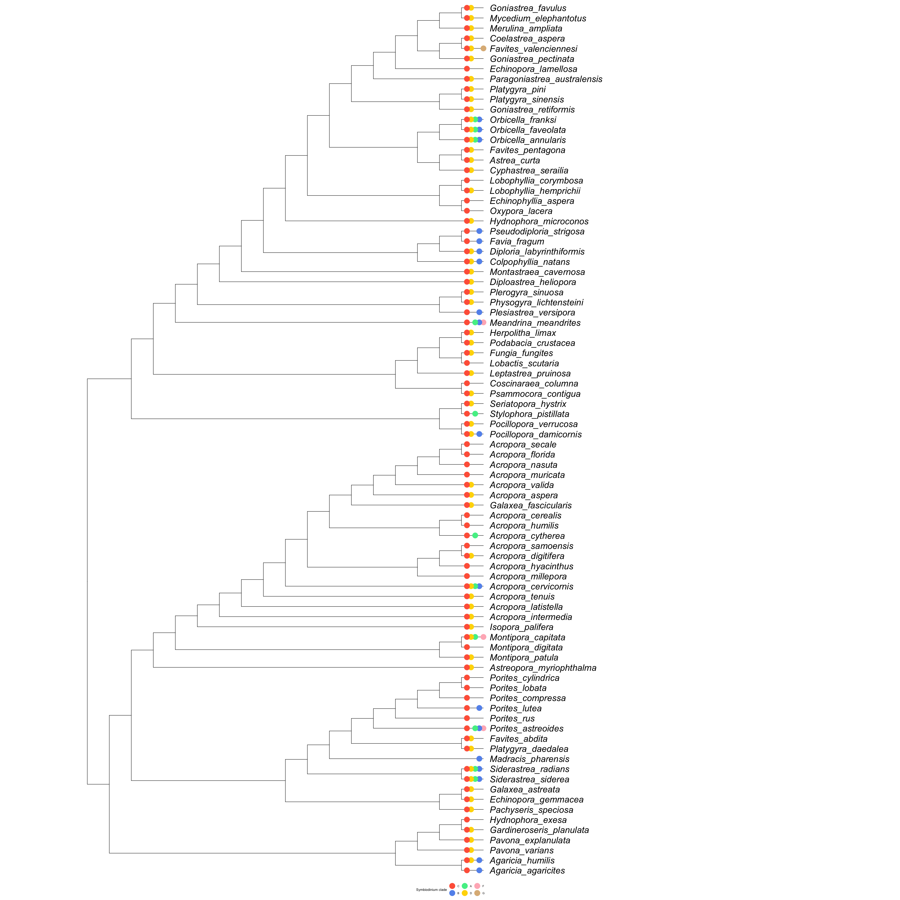
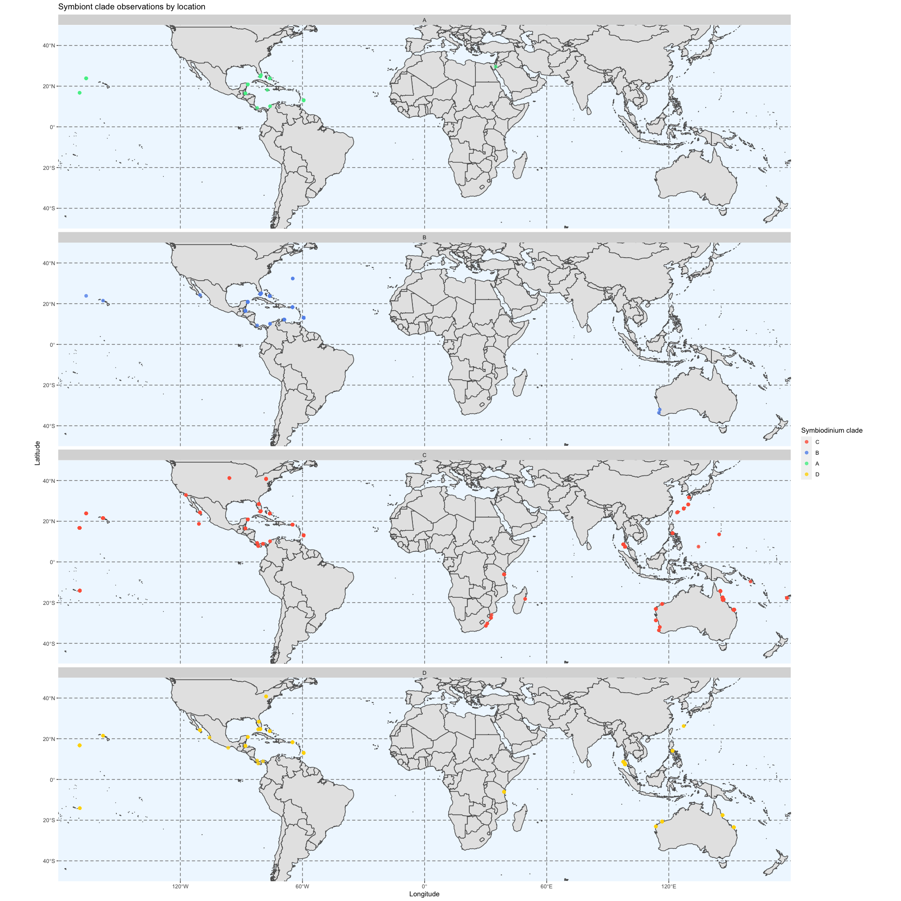

Final Project
================
R Ju
11/29/2020

\#\#Data collection

To begin, I will compile a list of known Symbiodinium clade associations
for all Scleractinia species [coraltraits.org](coraltraits.org). Data
downloaded from this site also includes the geographic location of the
sample, as well as methodology used. These factors may be useful in
comparative analyses.

``` r
#load in coraltraits.org data
syms <- read.csv("data/ctdb_1.1.0_data.csv") %>%
  filter(trait_name == "Symbiodinium clade") %>%
  select(specie_id, specie_name, location_id, location_name, trait_id, trait_name, methodology_id, methodology_name, value)

#visualize data (Symbiodinium clades by species)
# ggplot(syms) +
#   geom_bar(aes(x = value, fill = value)) + 
#   facet_wrap(~specie_name) + 
#   labs(x = 'Symbiodinium clade',
#        y = 'Observations') +
#   scale_fill_manual(breaks = c("C", "B", "A",  "D", "F", "G"), values = c("tomato", "cornflowerblue", "seagreen2", "gold", "lightpink", "burlywood"), name = "Symbiodinium clade") + 
#   theme_bw() + theme(panel.border = element_rect(color="black", fill=NA, size=0.75), panel.grid.major = element_blank(),
#                      panel.grid.minor = element_blank(), axis.line = element_blank()) 
```

Six different *Symbiodinium* clades are found within Scleractinia.
However, we see that clade C is dominant across most species.
Additionally, there is quite a bit of variation between the number of
observations for each species.

To better see the different *Symbiodinium* associations for each
species, we can also plot pie graphs representing the proportion of the
total number of observations attributed to each clade.

``` r
#visualize proportion data
syms_prop <- syms %>%
  count(specie_name, value) %>%
  group_by(specie_name) %>%
  mutate(prop = prop.table(n)) #saves prop table of symbiodinium clade by species
# syms_prop %>%
#   ggplot(aes(x = "", y = prop, fill = value), size = 12) +
#   geom_bar(stat = "identity", width = 0.5, color = "white") + 
#   coord_polar("y", start=0) +
#   scale_fill_manual(breaks = c("C", "B", "A",  "D", "F", "G"), values = c("tomato", "cornflowerblue", "seagreen2", "gold", "lightpink", "burlywood"), name = "Symbiodinium clade") + 
#   facet_wrap(~specie_name) + 
#   theme_void()
```

\#\#Phylogenetic inference

For this analysis, I will build a tree using

Clade name: Scleractinia (taxid: 6125)

Bait sequence: [Siderastrea radians mitochondrion, complete
genome](https://www.ncbi.nlm.nih.gov/nuccore/DQ643838.1?report=fasta)

Sequences were gathered and aligned with the NCBI blast tool. The
headings of the downloaded sequences were modified using the following
sed command:

    sed -E 's/>[a-zA-Z]+\|([a-zA-Z_?0-9\.]+)\|.+\[organism=([a-zA-Z0-9]+)( [a-zA-Z0-9]+\. | )([a-zA-Z0-9]+).+?/>\2_\4/g' alignment.raw.fasta > alignment.fasta

Whole mitochondrial genome sequences were chosen when available.
However, some species only have shorter mitochondrial sequences (12S,
16S, COI, CYTB, etc.). These sequences were aligned and concatenated
using the ‘apex’ R package.

Phylogeny was inferred using IQ-TREE and the cluster. Bootstrap analyses
were conducted to determine support values for the resulting tree.
BAYES?

Job script:

    #!/bin/bash
    
    #SBATCH --partition=eeb354
    #SBATCH --job-name=scler_iqtree
    #SBATCH --time=2:00:00
    #SBATCH --ntasks=1
    #SBATCH --cpus-per-task=8
    
    module load IQ-TREE/1.6.12
    
    iqtree -s alignment.cat.fasta -bb 1000 -nt AUTO

``` r
#read in cluster output
phy <- read.tree("cluster/final/alignment.cat.fasta.treefile") 

#drop tips not in symbiont clade data set
drops <- phy$tip.label[phy$tip.label %in% str_replace(syms_prop$specie_name, " ", "_") == FALSE]
phy1 <- drop.tip(phy, drops)

# #plot tree with support values
# plot(phy1) #maybe plot with ggtree? figure is messy and hard to read
# nodelabels(phy1$node.label)
```

``` r
#create data set with symb clade and tip labels
tips <- data.frame(tip.label=phy$tip.label, specie_name=str_replace(phy$tip.label, "_", " "))

symbs <- full_join(tips, syms_prop, by="specie_name") %>%
  filter(is.na(value) == FALSE) %>%
  group_by(tip.label) %>%
  dplyr::summarise(value = value) %>%
  filter(is.na(tip.label) == FALSE) %>% #removing internal nodes
  pivot_wider(names_from = value)

#plot cladogram
ggtree(phy1, branch.length = "none", size = 1) %<+% symbs +
  geom_tiplab(fontface = "italic", size = 10, offset = 0.2) +
  geom_tippoint(aes(color=F), size = 8) +
  geom_tippoint(aes(color=B), size = 8, position = position_dodge(width = 0.75)) +
  geom_tippoint(aes(color=A), size = 8, position = position_dodge(width = 1.5)) +
  geom_tippoint(aes(color=D), size = 8, position = position_dodge(width = 2.25)) +
  geom_tippoint(aes(color=C), size = 8, position = position_dodge(width = 3)) +
  scale_color_manual(breaks = c("C", "B", "A",  "D", "F"), values = c("tomato", "cornflowerblue", "seagreen2", "gold", "lightpink"), name = "Symbiodinium clade") + 
  xlim(-2, 40) + 
  theme(legend.position = "bottom")
```

<!-- -->

``` r
#read in location data with lat and long
locs <- read.csv("data/locations.csv") %>%
  select(location_id, latitude, longitude)

#combine with symbiont data
geosyms <- merge(locs, syms, by = "location_id")

world <- ne_countries(scale = "medium", returnclass = "sf")

ggplot() +
  geom_sf(data = world) +
  xlab("Longitude") + 
  ylab("Latitude") +
  geom_point(data = geosyms, aes(x = longitude, y = latitude, color = value), size = 2, alpha = 0.8) +
  scale_color_manual(breaks = c("C", "B", "A",  "D", "F", "G"), values = c("tomato", "cornflowerblue", "seagreen2", "gold", "lightpink", "burlywood"), name = "Symbiodinium clade") + 
  facet_wrap(~value, ncol = 1) +
  coord_sf(ylim = c(-50, 50), expand = FALSE) +
  ggtitle("Symbiont clade observations by location") +
  theme(panel.grid.major = element_line(color = gray(.5), linetype = "dashed", size = 0.5), panel.background = element_rect(fill = "aliceblue"))
```

<!-- -->
