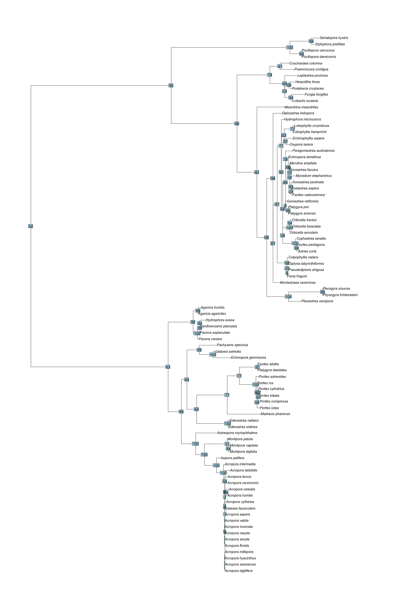

Final Project
================
R Ju
11/29/2020

## Data collection

To begin, I will compile a list of known *Symbiodinium* clade
associations for all *Scleractinia* species
[coraltraits.org](coraltraits.org). Data downloaded from this site also
includes the geographic location of the sample, as well as methodology
used. These factors may be useful in comparative analyses.

``` r
#load in coraltraits.org data
syms <- read.csv("data/ctdb_1.1.0_data.csv") %>%
  filter(trait_name == "Symbiodinium clade") %>%
  select(specie_id, specie_name, location_id, location_name, trait_id, trait_name, methodology_id, methodology_name, value) %>%
  group_by(specie_id) %>%
  filter(n() >= 10)

#write.csv(syms, "data/syms.csv")

#visualize data (Symbiodinium clades by species)
# p1 <- ggplot(syms) +
#   geom_bar(aes(x = value, fill = value)) +
#   facet_wrap(~specie_name) +
#   labs(x = 'Symbiodinium clade',
#        y = 'Observations') +
#   scale_fill_manual(breaks = c("C", "B", "A",  "D", "F", "G"), values = c("tomato", "cornflowerblue", "seagreen2", "gold", "lightpink", "burlywood"), name = "Symbiodinium clade") +
#   theme_bw() + theme(panel.border = element_rect(color="black", fill=NA, size=0.75), panel.grid.major = element_blank(),
#                      panel.grid.minor = element_blank(), axis.line = element_blank())
# p1 

#ggsave("output/sym_clades_bar.pdf", p1, width = 12, height = 9, units = "in")
```

Six different *Symbiodinium* clades are found within Scleractinia.
However, we see that clade C is dominant across most species.
Additionally, there is quite a bit of variation between the number of
observations for each species.

To better see the different *Symbiodinium* associations for each
species, we can also plot pie graphs representing the proportion of the
total number of observations attributed to each clade.

``` r
#visualize proportion data
syms_prop <- syms %>%
  count(specie_name, value) %>%
  group_by(specie_name) %>%
  mutate(prop = prop.table(n)) #saves prop table of symbiodinium clade by species
#write.csv(syms_prop, "data/syms_prop.csv")

# p2 <- syms_prop %>%
#   ggplot(aes(x = "", y = prop, fill = value), size = 12) +
#   geom_bar(stat = "identity", width = 0.5, color = "white") +
#   coord_polar("y", start=0) +
#   scale_fill_manual(breaks = c("C", "B", "A",  "D", "F", "G"), values = c("tomato", "cornflowerblue", "seagreen2", "gold", "lightpink", "burlywood"), name = "Symbiodinium clade") +
#   facet_wrap(~specie_name) +
#   theme_void() + theme(legend.position = "bottom")

#ggsave("output/sym_clades_pie.pdf", p2, width = 20, height = 10, units = "in")
```

Though this is more visually accessible, the issues with sample
size/observation bias remain. Going forward, I will treat symbiont clade
as a boolean variable (present, not present) rather than weighting by
number/percentage of observations. This is a simpler approach, but may
actually yield clearer results.

## Phylogenetic inference

For this analysis, I will build a tree using publicly available sequence
data for scleractinian corals, specifically the cytochrome c oxidase
subunit 1 (CO1) gene data.

Clade name: Scleractinia (taxid: 6125)

Bait sequence: [Acropora digitifera mitochondrial CO1 gene for
cytochrome c oxidase
subunit 1](https://www.ncbi.nlm.nih.gov/nuccore/LC029006.1?report=fasta)

Outgroup: Xestospongia testudinaria (taxid:178554)

Sequences were gathered and aligned with the NCBI blast tool. The
headings of the downloaded sequences were modified using the following
sed command:

    sed -E 's/>[a-zA-Z]+\|([a-zA-Z_?0-9\.]+)\|.+\[organism=([a-zA-Z0-9]+)( [a-zA-Z0-9]+\. | )([a-zA-Z0-9]+).+?/>\2_\4/g' alignment.co1.raw.fasta > alignment.co1.fasta

Sequences were concatenated using the ‘apex’ R package.

Phylogeny was inferred using IQ-TREE and the cluster. Bootstrap analyses
were conducted to determine support values for the resulting tree.

Job script:

    #!/bin/bash
    
    #SBATCH --partition=eeb354
    #SBATCH --job-name=scler_iqtree
    #SBATCH --time=2:00:00
    #SBATCH --ntasks=1
    #SBATCH --cpus-per-task=8
    
    module load IQ-TREE/1.6.12
    
    iqtree -s alignment.co1.cat.fasta -bb 1000 -nt AUTOn

The IQ-TREE composition chi-test fails for 101 species. This may be
addressed by using fewer genes (just COI and CYTB, for example) which
are more commonly available to reduce gaps. Troubleshooting of the
actual inference may also yield more results.

We can read in the treefile and look at the resulting phylogeny,
complete with support values from the ML analysis. The best fit model is
TVM+F+I+G4, based on BIC.

``` r
#read in cluster output
phyraw <- read.tree("data/cluster/final/alignment.co1.cat.fasta.treefile") 
phy <- root(phyraw, "Xestospongia_testudinaria")

#drop tips not in symbiont clade data set
drops <- phy$tip.label[phy$tip.label %in% str_replace(syms_prop$specie_name, " ", "_") == FALSE]
phy1 <- drop.tip(phy, drops)
#write.tree(phy1, "output/phy1")

#plot tree with support values
#pdf("output/tree_sv.pdf", width = 20, height = 30)
plot(phy1) 
nodelabels(phy1$node.label)
```

<!-- -->

``` r
#dev.off()
```

This tree is roughly as expected, as species within the same genus are
grouped in clades. As the current accepted classification of
scleractinian corals is also based on mitochondrial sequence data, this
is a good sign\! If time allows, I’d love to compare this tree more
closely with others in the literature.

## Mapping symbiont clade data onto the phylogenetic tree

Now that we have a tree, we can map our symbiont data onto the tips and
look for any signs of trait conservation within clades. To make
visualization easier, we can plot the tree as a cladogram (all total
branch lengths are the same). Actually plotting the data can be
difficult – here, I’ve done it by melting the symbiont data and dodging
points along the tips.

``` r
#create data set with symb clade and tip labels
tips <- data.frame(tip.label=phy1$tip.label, specie_name=str_replace(phy1$tip.label, "_", " "))

clades <- full_join(tips, filter(syms_prop, specie_name %in% str_replace(phy1$tip.label, "_", " ") == TRUE), by="specie_name") %>%
  filter(is.na(value) == FALSE) %>%
  group_by(tip.label, specie_name) %>%
  dplyr::summarise(value = value) %>%
  filter(is.na(tip.label) == FALSE) %>% #removing internal nodes
  pivot_wider(names_from = value)

#write.csv(clades, "data/clades.csv")

#plot cladogram
p3 <- ggtree(phy1, branch.length = "none") %<+% clades +
  geom_tiplab(fontface = "italic", size = 10, offset = 0.2) +
  geom_tippoint(aes(color=G), size = 8, position = position_dodge(width = 0)) +
  geom_tippoint(aes(color=F), size = 8) +
  geom_tippoint(aes(color=B), size = 8, position = position_dodge(width = 0.75)) +
  geom_tippoint(aes(color=A), size = 8, position = position_dodge(width = 1.5)) +
  geom_tippoint(aes(color=D), size = 8, position = position_dodge(width = 2.25)) +
  geom_tippoint(aes(color=C), size = 8, position = position_dodge(width = 3)) +
  scale_color_manual(breaks = c("C", "B", "A",  "D", "F", "G"), values = c("tomato", "cornflowerblue", "seagreen2", "gold", "lightpink", "burlywood"), name = "Symbiodinium clade") + 
  xlim(-2, 35) +  
  theme(legend.position = "bottom")
p3
```

<!-- -->

``` r
#ggsave("output/tree_sym.pdf", p3, width = 30, height = 40, units = "in")
```

As clade C is almost ubiquitous, a first glance at this cladogram
doesn’t reveal that much in terms of phylogenetic conservation.
However, it does seem that associations with less common clades, such as
B or A, tend to be shared across sister tips (ex. Orbicella spp.).

## Geospatial distribution of symbiont clades

I hypothesize that geospatial distribution may also correlate with
symbiont clade associations. Of course, as species are not randomly
distributed, phylogenetic relationships and location data are often
inseparable. However, it is still interesting to visualize the
distribution of symbiont clades.

Here, I plot each symbiont clade observation onto a world map.

``` r
#read in location data with lat and long
locs <- read.csv("data/locations.csv") %>%
  dplyr::select(location_id, latitude, longitude)

#combine with symbiont data
geosyms <- merge(locs, syms, by = "location_id")
#write.csv(geosyms, "data/geosyms.csv")

world <- ne_countries(scale = "medium", returnclass = "sf")

p4 <- ggplot() +
  geom_sf(data = world) +
  xlab("Longitude") + 
  ylab("Latitude") +
  geom_point(data = filter(geosyms, value %in% c("A", "B", "C", "D") == TRUE), aes(x = longitude, y = latitude, color = value), size = 2, alpha = 0.8) +
  scale_color_manual(breaks = c("C", "B", "A",  "D"), values = c("tomato", "cornflowerblue", "seagreen2", "gold"), name = "Symbiodinium clade") + 
  facet_wrap(~value, ncol = 1) +
  coord_sf(ylim = c(-50, 50), expand = FALSE) +
  ggtitle("Symbiont clade observations by location") +
  theme(panel.grid.major = element_line(color = gray(.5), linetype = "dashed", size = 0.5), panel.background = element_rect(fill = "aliceblue"))
p4
```

<!-- -->

``` r
#ggsave("output/geodist_syms.pdf", p4, width = 11, height = 8.5, units = "in")
```

Clades C and D are well distributed, while clades A and B seem
restricted to the Atlantic/Caribbean.

## Testing for phylogenetic signal

``` r
levels <- as.factor(str_replace(phy1$tip.label, "_", " "))
                    
#test 1: keep only most commonly observed clade
max <- syms_prop %>%
  filter(specie_name %in% str_replace(phy1$tip.label, "_", " ") == TRUE) %>%
  group_by(specie_name) %>%
  slice(which.max(prop)) %>%
  dplyr::select(specie_name, value) %>%
  arrange(factor(specie_name, levels = levels)) 
maxv <- setNames(max$value, str_replace(max$specie_name, " ", "_"))
maxfit <- fitDiscrete(phy1, maxv, method = "ABD", transform = "lambda")

#test 2: consider associations with each clade as a separate binary trait
multi <- clades %>%
    arrange(factor(specie_name, levels = levels)) %>%
    mutate(A = ifelse(is.na(A), "N", "Y")) %>%
    mutate(B = ifelse(is.na(B), "N", "Y")) %>%
    mutate(C = ifelse(is.na(C), "N", "Y")) %>%
    mutate(D = ifelse(is.na(D), "N", "Y")) %>%
    mutate(F = ifelse(is.na(F), "N", "Y")) %>%
    mutate(G = ifelse(is.na(G), "N", "Y"))

 multi2 <- data.frame(multi[, 3:8])
 rownames(multi2) <- multi$tip.label
(multifit <- fitDiscrete(phy1, multi2, method = "ABD", transform = "lambda"))
```

    ## $C
    ## GEIGER-fitted comparative model of discrete data
    ##  fitted Q matrix:
    ##               N         Y
    ##     N -0.589055  0.589055
    ##     Y  0.589055 -0.589055
    ## 
    ##  fitted 'lambda' model parameter:
    ##  lambda = 1.000000
    ## 
    ##  model summary:
    ##  log-likelihood = -4.641292
    ##  AIC = 13.282584
    ##  AICc = 13.427162
    ##  free parameters = 2
    ## 
    ## Convergence diagnostics:
    ##  optimization iterations = 100
    ##  failed iterations = 39
    ##  number of iterations with same best fit = NA
    ##  frequency of best fit = NA
    ## 
    ##  object summary:
    ##  'lik' -- likelihood function
    ##  'bnd' -- bounds for likelihood search
    ##  'res' -- optimization iteration summary
    ##  'opt' -- maximum likelihood parameter estimates
    ## 
    ## $D
    ## GEIGER-fitted comparative model of discrete data
    ##  fitted Q matrix:
    ##               N         Y
    ##     N -2.621186  2.621186
    ##     Y  2.621186 -2.621186
    ## 
    ##  fitted 'lambda' model parameter:
    ##  lambda = 0.413510
    ## 
    ##  model summary:
    ##  log-likelihood = -56.493236
    ##  AIC = 116.986471
    ##  AICc = 117.131049
    ##  free parameters = 2
    ## 
    ## Convergence diagnostics:
    ##  optimization iterations = 100
    ##  failed iterations = 54
    ##  number of iterations with same best fit = NA
    ##  frequency of best fit = NA
    ## 
    ##  object summary:
    ##  'lik' -- likelihood function
    ##  'bnd' -- bounds for likelihood search
    ##  'res' -- optimization iteration summary
    ##  'opt' -- maximum likelihood parameter estimates
    ## 
    ## $A
    ## GEIGER-fitted comparative model of discrete data
    ##  fitted Q matrix:
    ##               N         Y
    ##     N -2.233243  2.233243
    ##     Y  2.233243 -2.233243
    ## 
    ##  fitted 'lambda' model parameter:
    ##  lambda = 0.906707
    ## 
    ##  model summary:
    ##  log-likelihood = -30.358380
    ##  AIC = 64.716761
    ##  AICc = 64.861339
    ##  free parameters = 2
    ## 
    ## Convergence diagnostics:
    ##  optimization iterations = 100
    ##  failed iterations = 60
    ##  number of iterations with same best fit = NA
    ##  frequency of best fit = NA
    ## 
    ##  object summary:
    ##  'lik' -- likelihood function
    ##  'bnd' -- bounds for likelihood search
    ##  'res' -- optimization iteration summary
    ##  'opt' -- maximum likelihood parameter estimates
    ## 
    ## $B
    ## GEIGER-fitted comparative model of discrete data
    ##  fitted Q matrix:
    ##               N         Y
    ##     N -15.20467  15.20467
    ##     Y  15.20467 -15.20467
    ## 
    ##  fitted 'lambda' model parameter:
    ##  lambda = 0.994382
    ## 
    ##  model summary:
    ##  log-likelihood = -34.564287
    ##  AIC = 73.128574
    ##  AICc = 73.273152
    ##  free parameters = 2
    ## 
    ## Convergence diagnostics:
    ##  optimization iterations = 100
    ##  failed iterations = 57
    ##  number of iterations with same best fit = NA
    ##  frequency of best fit = NA
    ## 
    ##  object summary:
    ##  'lik' -- likelihood function
    ##  'bnd' -- bounds for likelihood search
    ##  'res' -- optimization iteration summary
    ##  'opt' -- maximum likelihood parameter estimates
    ## 
    ## $G
    ## GEIGER-fitted comparative model of discrete data
    ##  fitted Q matrix:
    ##                 N           Y
    ##     N -0.03788073  0.03788073
    ##     Y  0.03788073 -0.03788073
    ## 
    ##  fitted 'lambda' model parameter:
    ##  lambda = 0.000000
    ## 
    ##  model summary:
    ##  log-likelihood = -5.323356
    ##  AIC = 14.646713
    ##  AICc = 14.791291
    ##  free parameters = 2
    ## 
    ## Convergence diagnostics:
    ##  optimization iterations = 100
    ##  failed iterations = 51
    ##  number of iterations with same best fit = NA
    ##  frequency of best fit = NA
    ## 
    ##  object summary:
    ##  'lik' -- likelihood function
    ##  'bnd' -- bounds for likelihood search
    ##  'res' -- optimization iteration summary
    ##  'opt' -- maximum likelihood parameter estimates
    ## 
    ## $F
    ## GEIGER-fitted comparative model of discrete data
    ##  fitted Q matrix:
    ##                N          Y
    ##     N -0.1165068  0.1165068
    ##     Y  0.1165068 -0.1165068
    ## 
    ##  fitted 'lambda' model parameter:
    ##  lambda = 0.000000
    ## 
    ##  model summary:
    ##  log-likelihood = -13.080222
    ##  AIC = 30.160445
    ##  AICc = 30.305023
    ##  free parameters = 2
    ## 
    ## Convergence diagnostics:
    ##  optimization iterations = 100
    ##  failed iterations = 43
    ##  number of iterations with same best fit = NA
    ##  frequency of best fit = NA
    ## 
    ##  object summary:
    ##  'lik' -- likelihood function
    ##  'bnd' -- bounds for likelihood search
    ##  'res' -- optimization iteration summary
    ##  'opt' -- maximum likelihood parameter estimates
    ## 
    ## attr(,"class")
    ## [1] "gfits" "list"

``` r
 #test 3: consider number of clade associations
num <- syms_prop %>%
  filter(specie_name %in% str_replace(phy1$tip.label, "_", " ") == TRUE) %>%
  count(specie_name) %>%
  arrange(factor(specie_name, levels = levels)) 
numv <- setNames(num$n, str_replace(num$specie_name, " ", "_"))
(numfit <- fitDiscrete(phy1, numv, method = "ABD", transform = "lambda"))
```

    ## GEIGER-fitted comparative model of discrete data
    ##  fitted Q matrix:
    ##                1          2          3          4
    ##     1 -2.8380312  0.9460104  0.9460104  0.9460104
    ##     2  0.9460104 -2.8380312  0.9460104  0.9460104
    ##     3  0.9460104  0.9460104 -2.8380312  0.9460104
    ##     4  0.9460104  0.9460104  0.9460104 -2.8380312
    ## 
    ##  fitted 'lambda' model parameter:
    ##  lambda = 0.398751
    ## 
    ##  model summary:
    ##  log-likelihood = -99.091761
    ##  AIC = 202.183522
    ##  AICc = 202.328100
    ##  free parameters = 2
    ## 
    ## Convergence diagnostics:
    ##  optimization iterations = 100
    ##  failed iterations = 59
    ##  number of iterations with same best fit = NA
    ##  frequency of best fit = NA
    ## 
    ##  object summary:
    ##  'lik' -- likelihood function
    ##  'bnd' -- bounds for likelihood search
    ##  'res' -- optimization iteration summary
    ##  'opt' -- maximum likelihood parameter estimates
