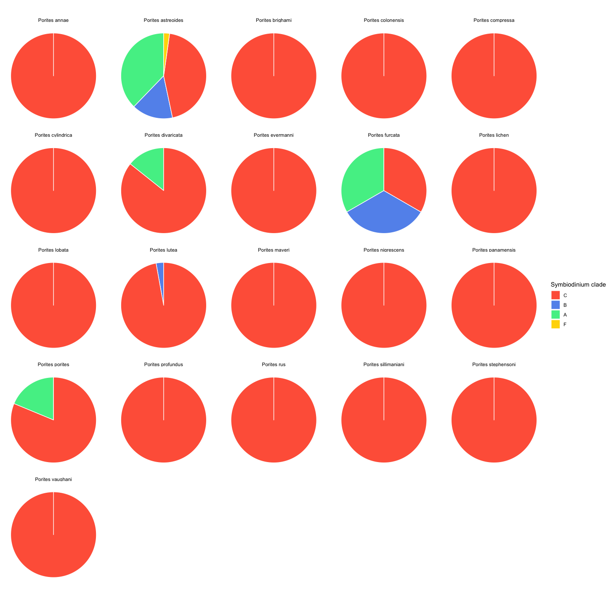
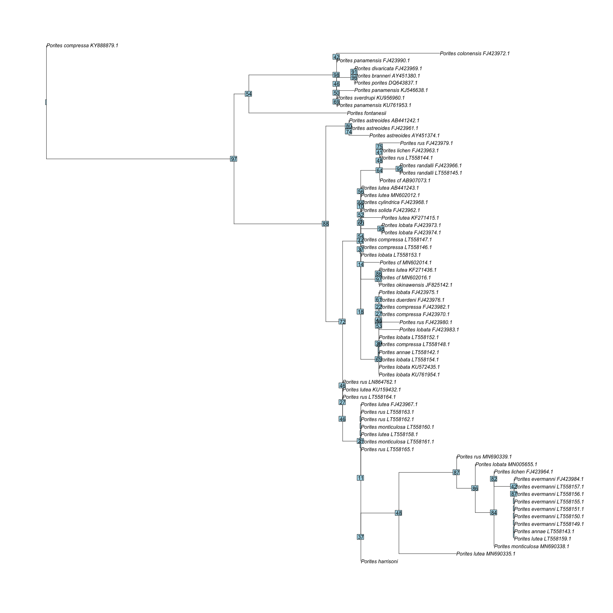
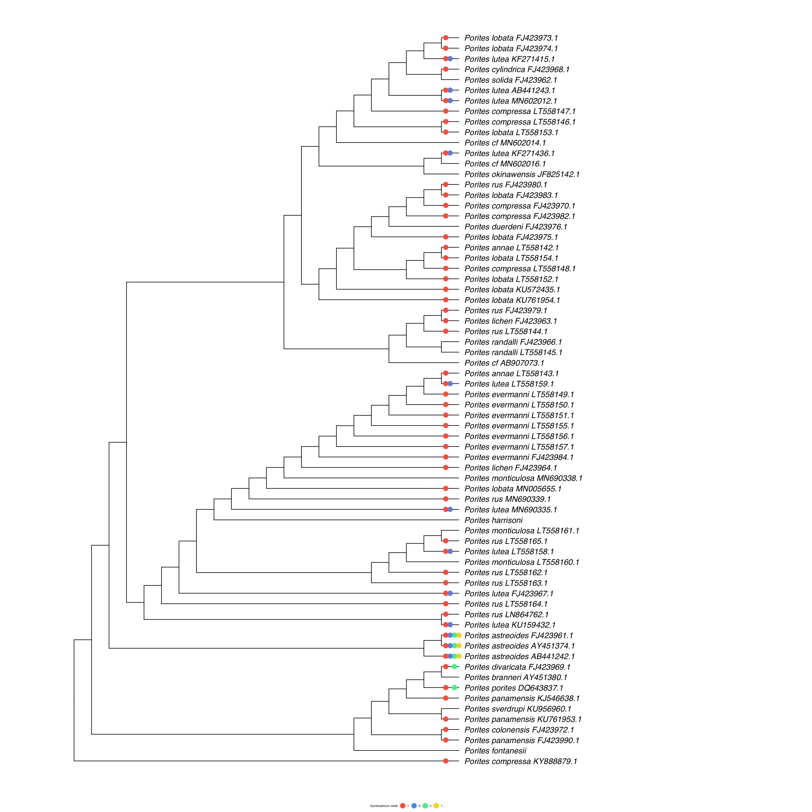

Minimum Viable Analysis
================
R Ju
10/22/2020

Data collection
---------------

To begin, I will compile a list of known Symbiodinium clade associations for species within the genus *Porites* from [coraltraits.org](coraltraits.org). This is an abundant and widespread genus of scleractinian corals. Data downloaded from this site also includes the geographic location of the sample, as well as methodology used. These factors may be useful in comparative analyses with a larger data set.

``` r
#load in coraltraits.org data and filter for relevant species and trait
por_sym <- read.csv("data/ctdb_1.1.0_data.csv") %>%
  filter(trait_name == "Symbiodinium clade" & str_detect(specie_name, "Porites")) %>%
  select(specie_id, specie_name, location_id, location_name, trait_id, trait_name, methodology_id, methodology_name, value)

#visualize data (Symbiodinium clades by species)
ggplot(por_sym) +
  geom_bar(aes(x = value, fill = value)) + 
  facet_wrap(~specie_name) + 
  labs(x = 'Symbiodinium clade',
       y = 'Observations') +
  scale_fill_manual(breaks = c("C", "B", "A", "F"), values = c("tomato", "cornflowerblue", "seagreen2", "gold"), name = "Symbiodinium clade") + 
  theme_bw() + theme(panel.border = element_rect(color="black", fill=NA, size=0.75), panel.grid.major = element_blank(),
                     panel.grid.minor = element_blank(), axis.line = element_blank()) 
```


Four different *Symbiodinium* clades are found in the genus *Porites*. However, we see that clade C is dominant across most species. Additionally, there is wide variation between the number of observations for each species. This could lead to trouble later on, so in future analyses it may be worth investigating other data sources.

To better see the different *Symbiodinium* associations for each species, we can also plot pie graphs representing the proportion of the total number of observations attributed to each clade.

``` r
#visualize proportion data
por_sym_prop <- por_sym %>%
  count(specie_name, value) %>%
  group_by(specie_name) %>%
  mutate(prop = prop.table(n)) #saves prop table of symbiodinium clade by species
por_sym_prop %>%
  ggplot(aes(x = "", y = prop, fill = value), size = 12) +
  geom_bar(stat = "identity", width = 0.5, color = "white") + 
  coord_polar("y", start=0) +
  scale_fill_manual(breaks = c("C", "B", "A", "F"), values = c("tomato", "cornflowerblue", "seagreen2", "gold"), name = "Symbiodinium clade") + 
  facet_wrap(~specie_name) + 
  theme_void()
```



Again, it is clear that clade C is dominant, as it is observed in every species. However, five species also were found to associate with other clades. For this initial analysis, the goal will be to map these observations to a phylogenetic tree, and examine if there is evidence that associations with non-C clade *Symbiodinium* are conserved phylogenetically.

Subsequent analyses may yield a far more diverse assortment of *Symbiodinium* associations — this initial glance suggests that clade association may be consistent across genera. It will certainly be interesting to expand the data set, as well as to examine the effects of other factors such as geographical location on clade association.

Phylogenetic inference
----------------------

For this analysis, I will build a tree using just the CO1 (cytochrome c oxydase 1) gene. The scleractinian coral species *Siderastrea siderea* will serve as the outgroup. As this project continues, I will gather additional gene sequences to use in the phylogenetic inference, and refine the outgroup choice as needed.

Clade name: Porites (taxid: 46719)

Outgroup: Siderastrea siderea (taxid: 130672)

Bait sequence:

    >HM754452.1 Palythoa cf. heliodiscus SMH-2011 isolate 305.11.2 cytochrome oxidase subunit I (CO1) gene, partial cds; mitochondrial
      CAGGTAAACTTCAGGGTGACCAAAAAATCAAAAGAGATGTTGAAACAGAATCGGGTCCCCCCCTCCGGCG
      GGGTCAAAGAAAGTAGTGTTAAAATTCCTATCTGTCAACAGCATGGTTATAGCCCCGGCCAATACGGGCA
      AAGACAGTAACAATAAGAAGGCGGTGATTAAGATAGACCACACAAAGAGTGGCAATCTATCCATTGTCAT
      ACCCGGGGCCCTCATATTAAATATAGTGGTGATAAAATTCATAGCCCCTAAGATGGAAGAGACCCCGGCC
      AAGTGGAGGCTAAATATAACCATGTCCACGGCCCCCCCCGAATGAGCTTGAATGGCTGAAAGAGGCGGAT
      ACACCGTCCAACCTGTTCCTGCCCCCTGTTCCACAAAGGCGGAACCCAACAATAGAATTAGGGCGGGGGG
      CAAGAGCCAGAAACTAATGTTATTTAGTCGCGGGAAGGCCATATCTGGTGCACCGATATATAGCGGCACC
      AACCAATTCCCAAACCCCCCTATCATCACCGGCATCACCAGGAAAAAGATCATAACAAAAGCATGCGCAG
      TCACGATTACATTATAAAGATGGTCGTCCCCCAACATAGTTCCGGGAGCAGAAAGTTCTAACCTTATCAA
      CATACTGAAAGCTGTTCCTATCATACCGGCCCCAACACCAAATATTAGATATAATGTGCCAATATCTTTA
      TGATTTGTTGACCGTCGTTT

Phylogeny was inferred using IQ-TREE and the cluster. Bootstrap analyses were conducted to determine support values for the resulting tree. Further work will compare models as well as use Bayesian analyses to determine phylogenetic topology.

Job script:

    #!/bin/bash

    #SBATCH --partition=eeb354
    #SBATCH --job-name=clade_iqtree
    #SBATCH --time=2:00:00
    #SBATCH --ntasks=1
    #SBATCH --cpus-per-task=8

    module load IQ-TREE/1.6.12

    iqtree -s por.co1.alignment.fasta -bb 1000 -nt AUTO

The tips of this tree correspond to individual sequences, rather than species. As such, visualization requires adjustment of the tip labels to match the *Symbiodinium* dataset. Some studies consolidate sequences by species before building tree and mapping on the data, while others do not. I think using multiple genes will force consolidation by species, but this will become more complex when considering cryptic speciation or unclassified samples. Ultimately, the goal is to ensure that there is a 1:1 relationship between the *Symbiodinium* samples and the phylogenetic sequences.

``` r
#read in cluster output
por_phy <- read.tree("cluster/por.co1.alignment.fasta.treefile") 

#clean up tip labels and manually correct erros
por_phy$tip.label <- por_phy$tip.label %>%
  str_replace_all("_"," ")
por_phy$tip.label[2] <- "Porites harrisoni " #unsure why the sed line failed!
por_phy$tip.label[62] <- "Porites fontanesii "

# por_phy$tip.label <- str_sub(por_phy$tip.label, end = sapply(str_locate_all(por_phy$tip.label," "), "[[", 2)-1)

#remove outgroup for easier plotting  
por_phy <- drop.tip(por_phy, "Siderastrea siderea AY451386.1")

#plot tree with support values
plot(por_phy) #maybe plot with ggtree? figure is messy and hard to read
nodelabels(por_phy$node.label)
```



There are definitely a few concerning things about this tree — many of the support values seem quite low, suggesting there is a better topology that was not reached by this basic model. Additionally, sequences from the same species are not always adjacent. These issues may be resolved with additional data. Also, branch lengths and evolutionary time are not as vital to my analysis. However, I'd like to investigate more as to why there is such high variation in the branch lengths.

To assess if *Symbiodinium* associations reflect phylogeny, I mapped the observed clades onto the tips of the tree. (This actually turned out to be obscenely difficult to do, and I'm still not happy with the figure!) As I kept the individual sequences, there are repeat species in this tree. However, I think it's useful to be able to see the individual sequences, and the *Symbiodinium* clades were mapped on by observed/not observed, rather than by proportion/\# of observations. I may change how they are mapped on once more data is included.

``` r
#create data set with symb clade and tip labels
tips <- data.frame(tip.label=por_phy$tip.label, specie_name=str_sub(por_phy$tip.label, end = sapply(str_locate_all(por_phy$tip.label," "), "[[", 2)-1))

syms <- full_join(tips, por_sym_prop, by="specie_name") %>%
  filter(is.na(value) == FALSE) %>%
  group_by(tip.label) %>%
  dplyr::summarise(value = value) %>%
  filter(is.na(tip.label) == FALSE) %>%
  pivot_wider(names_from = value)

#plot cladogram
ggtree(por_phy, branch.length = "none", size = 1) %<+% syms +
  geom_tiplab(fontface = "italic", size = 10, offset = 0.2) +
  geom_tippoint(aes(color=F), size = 8) +
  geom_tippoint(aes(color=A), size = 8, position = position_dodge(width = 1)) +
  geom_tippoint(aes(color=B), size = 8, position = position_dodge(width = 2)) +
  geom_tippoint(aes(color=C), size = 8, position = position_dodge(width = 3)) +
  scale_color_manual(breaks = c("C", "B", "A", "F"), values = c("tomato", "cornflowerblue", "seagreen2", "gold"), name = "Symbiodinium clade") + 
  xlim(-2, 40) + 
  theme(legend.position = "bottom")
```



It does not seem that associations with non-C clades of *Symbiodinium* are entirely random, as they aren't just scattered across the phylogeny. However, I don't feel comfortable drawing any conclusions from this figure — it doesn't capture enough data, and I'm not confident in the phylogenetic inference. Even so, this gives me a clear idea of how I want to move forward, and I definitely have some interesting hypotheses I want to investigate!
